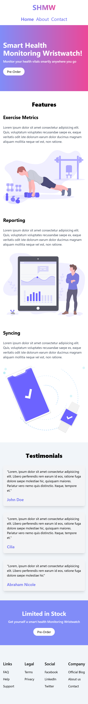
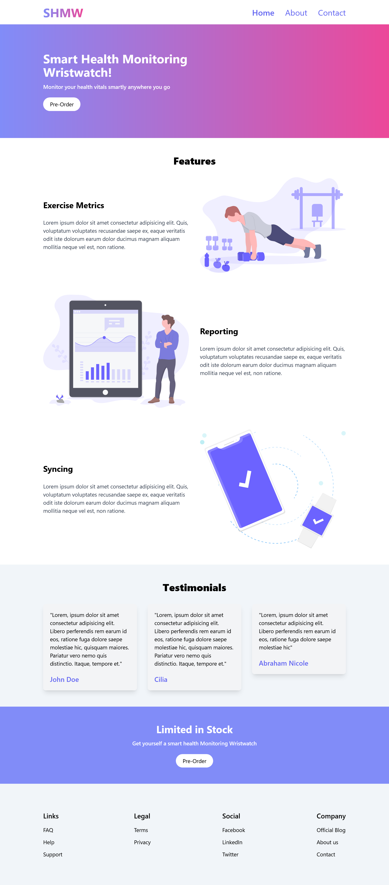

# SHMW Landing Page

  This is my first tailwind css project...I tried to make a landing page for SHMW(Smart health monitoring wristwatch)[^1].

  The design was adopted from [build-a-beautiful-landing-page-with-tailwind-css](https://assets.digitalocean.com/articles/build-a-beautiful-landing-page-with-tailwind-css/1.png).The assets are available on this [Github page](https://github.com/ammezie/tailwind_landing_page/tree/master/assets).[^2] 

## Task

- [x] Setting up the project
- [x] Make the landing page using tailwind css
- [x] Push the code to github

## Screenshots

### Mobile version


### Desktop version


## Build with

* HTML
* CSS
* TAILWIND CSS
* MOBILE FIRST APPROACH

## What I Learned

  I tried to implement things i learned so far in tailwind css..Laerned to setting up the tailwind project.Learned applying gradien to text...and more[^3].

  ```
    <a href="#" class="text-4xl font-bold text-transparent bg-clip-text bg-gradient-to-r from-indigo-400 to-pink-500 hover:text-indigo-500">SHMW</a>

  ```

 ## Useful links

 

 
